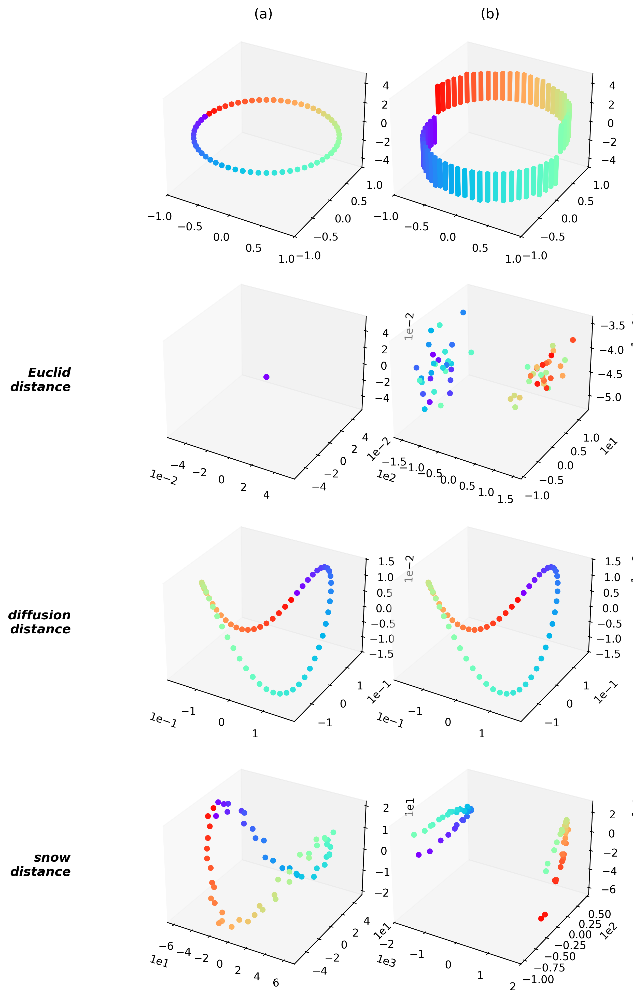
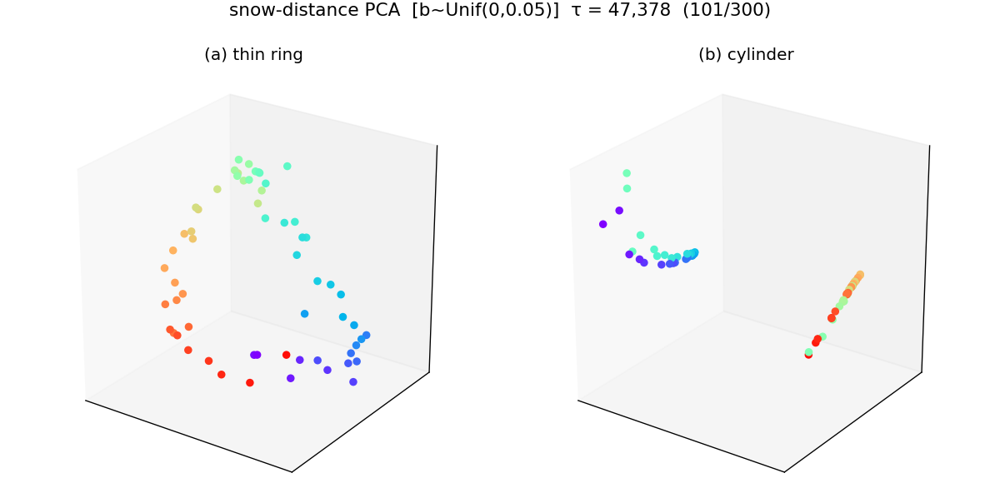
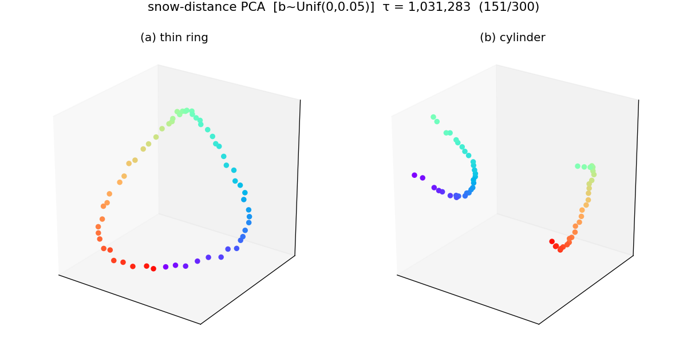
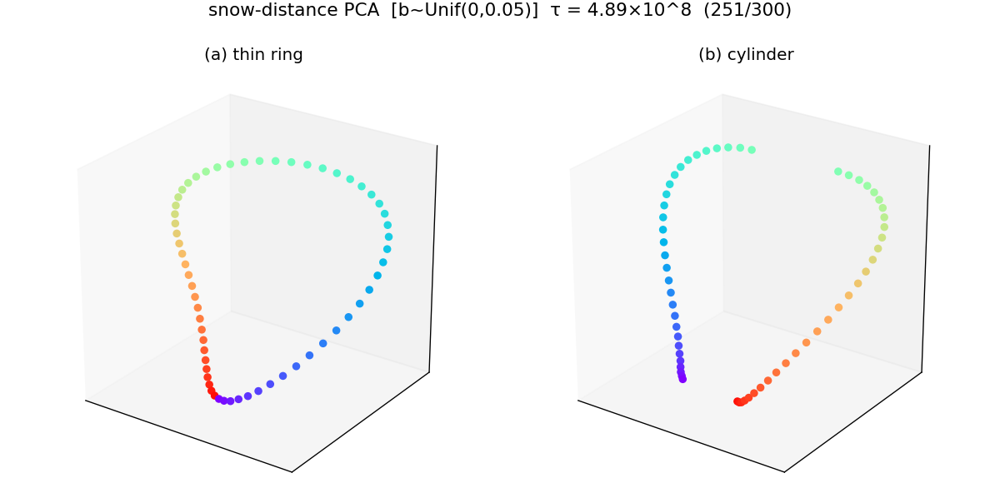
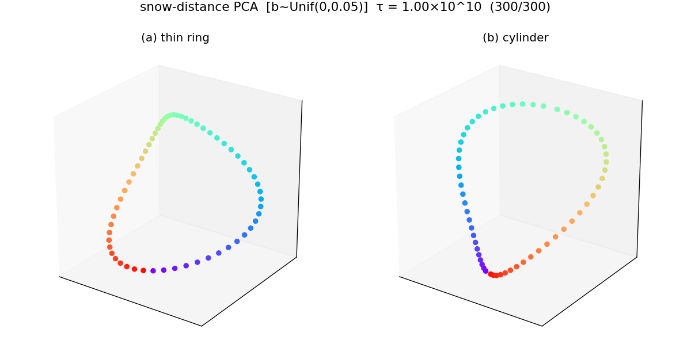
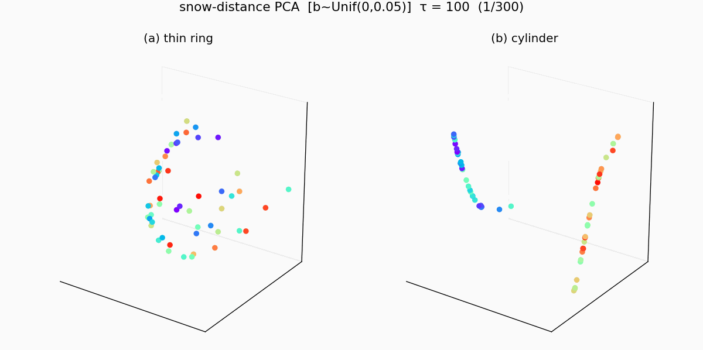

아래는 논문의 Example 2 원본 그림이다. 위쪽이 원래 세팅 — (a) 신호 없는 thin ring, (b) $y=\pm3$ cylinder 신호 — 이고, 아래 3행이 각각 Euclidean / diffusion / snow distance 임베딩이다.

이 논문 그림의 아래쪽 snow distance 세팅에서 시뮬레이션을 훨씬 더 오래 진행해 보았다. 눈량을 $b_t \sim \mathrm{Uniform}(0, 0.05)$ 로 랜덤 추출하면서 $\tau$ 를 100번부터 100억번까지 늘려 본 것이다. 이걸 끝까지 돌려본 이유는 (1) 정말로 유클리드 거리에서 출발해서 그래프 거리로 수렴하는지 (2) 눈의양을 고정적인 $b$로 하든 $U(0,b)$로 하든 같은 결과를 주는지 확인하고 싶었기 때문.

`-` $\tau \approx 47{,}000$ (약 5만번): 논문그림과 비슷한 상황

`-` $\tau \approx 100$만번 (백만번): 약 5만번의 결과와 비슷. 전체적으로 디노이징된 상태

`-` $\tau \approx 5$억번: 클리프 소멸. 거의 닫힌 링.

`-` $\tau = 100$억번: 초기효과 소멸. (a) 와 (b) 모두 완전한 링으로 수렴.

`-` 전체 애니메이션 (100번 $\to$ 100억번, 로그 스케일 300 프레임):

> 이 결과는 눈을 $U(0,b)$에서 추출한 경우이며, 눈을 고정값 $b$로 뿌렸을 경우도 같은 결과를 얻을 수 있었음.