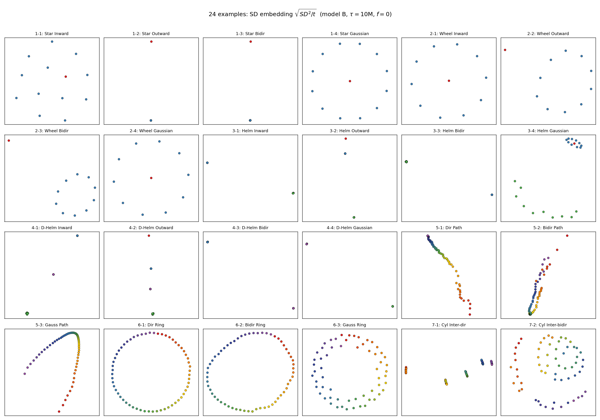
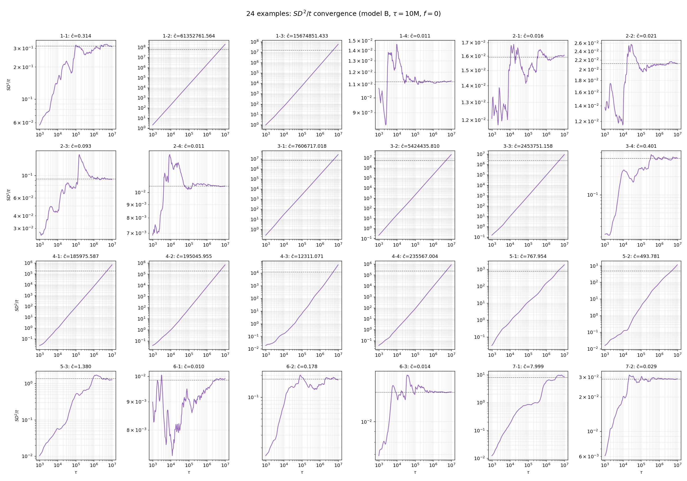

각 노드의 장기 적립률을 $\rho_i = \lim_{t\to\infty} \frac{1}{t}\sum_{s=1}^t \mathbf{1}\{X_s = v_i\}$ 라 하자. $\rho$가 균등한지 여부에 따라 SD의 스케일링이 달라진다.

## A. 그래프 구조 검증 ($f = 0$)

### A.1 SD 임베딩

각 그래프에서 시뮬 후 $\sqrt{SD^2_{ij}/\tau}$ 의 2D MDS 임베딩.

### A.2 $SD^2/t$ 수렴 곡선 (log-log)

같은 24 예제의 $\overline{SD^2/t}$ (off-diagonal 평균) 를 $\tau$ 에 대해 log-log plot. 수렴하면 수평선, 발산하면 양의 기울기.

## B. 신호 변형 검증 ($f \neq 0$)

### B.1 Parity Cycle $C_{60}$ — $f_i = (-1)^i$

### B.2 Directed Cycle $C_{60}$ — $f = \pm 1$

### B.3 Outlier Cylinder

---

