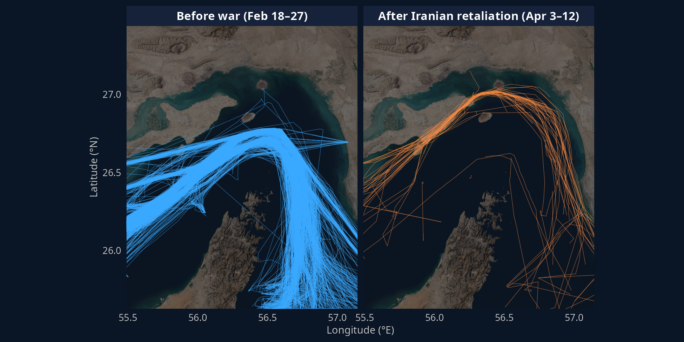
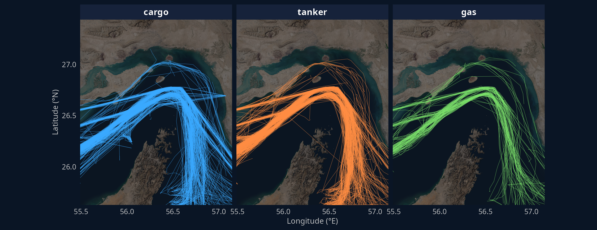
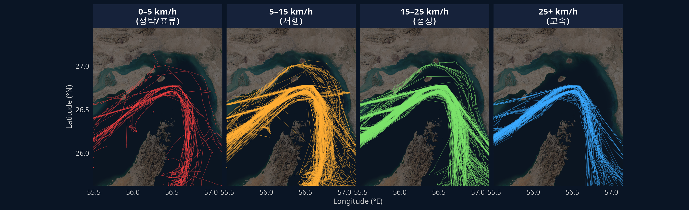
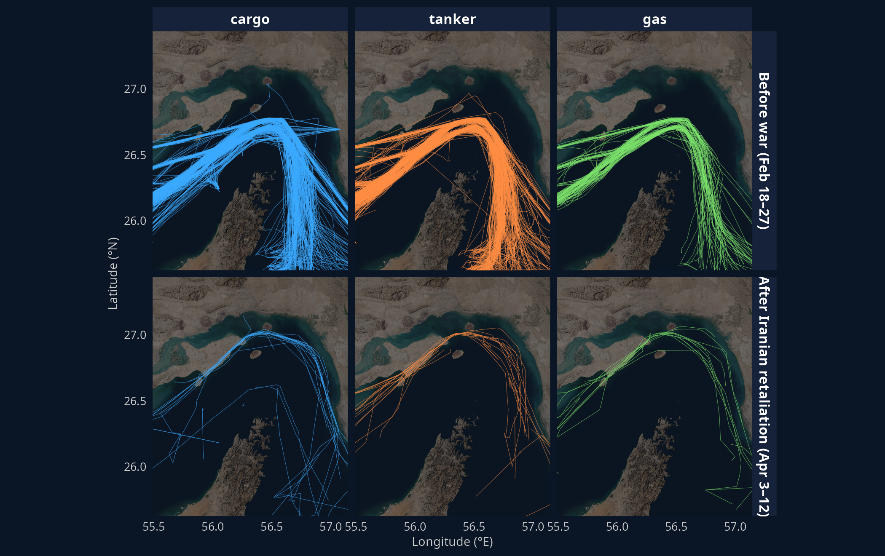
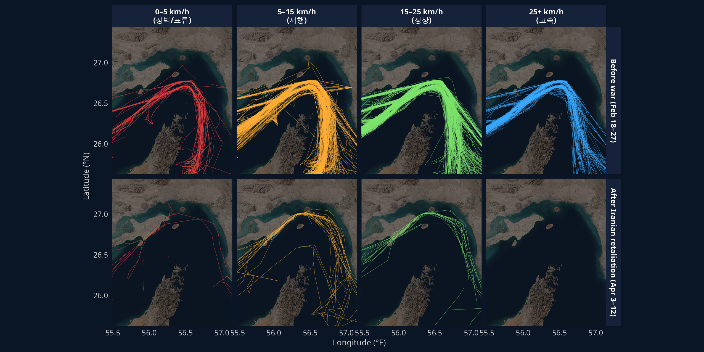

전쟁 전 (파랑), 보복기 (주황)

{fig-align="center"}

선종별로 보면 cargo · tanker · gas 모양이 거의 같다. 선종은 경로를 가르는 변수가 아닌 것 같음.

{fig-align="center"}

속도 구간이 항로를 꽤 잘 가른다. 0–5 km/h 는 한곳에 모여있고 (정박·대기), 15–25 가 메인 다발, 25+ 는 적고 곧게 통과.

{fig-align="center"}

시기 × 선종 2 × 3 으로 펼치면 아래 줄 (보복기) 이 1/10 수준. 셋 다 약간씩 이란 쪽 새 항로가 생긴 게 보이지만 표본이 적다.

{fig-align="center"}

시기 × 속도 2 × 4 가 본 글에서 가장 의미있는듯. 보복기엔 25+ km/h 트랙이 거의 없음 (모두 천천히 다님, 그런데 표본이 적음)

{fig-align="center"}
