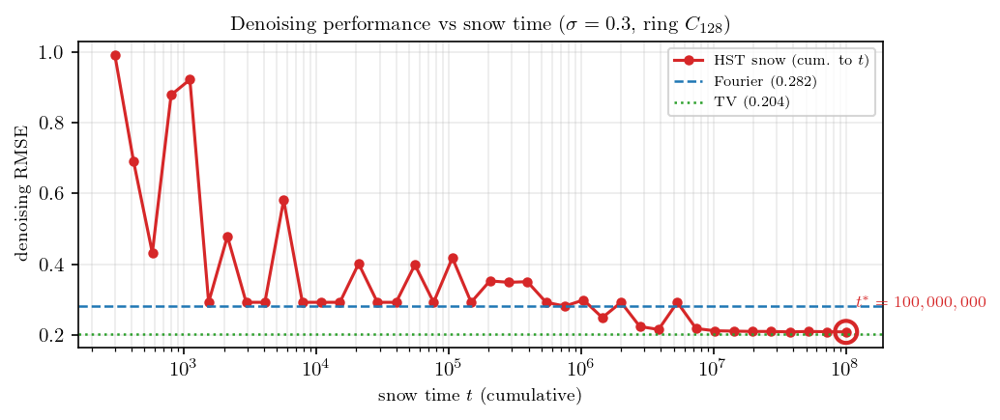
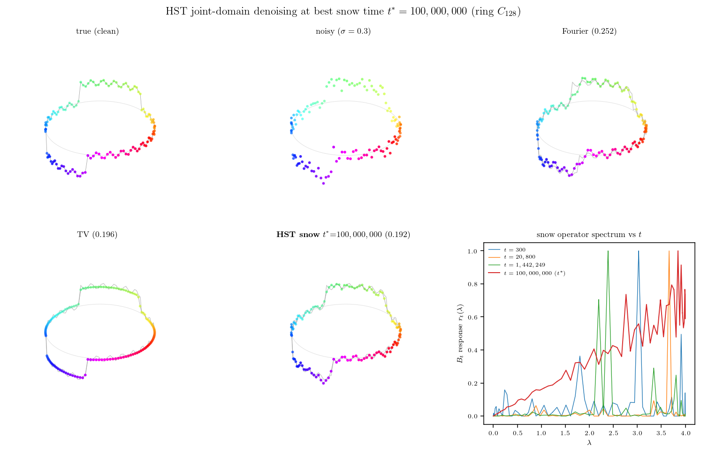
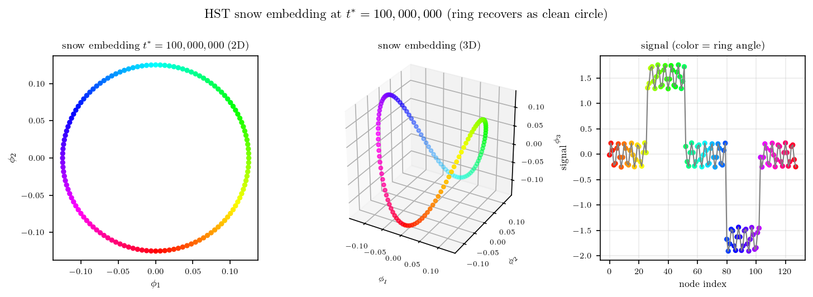

링 위에 **빠른 진동**과 **큰 점프**를 동시에 깐 신호를 디노이징해봤음. 이런 신호가 까다로운 이유는, 진동은 Fourier(스펙트럼) 쪽이 잘 잡고 점프는 TV(국소 차분) 쪽이 잘 잡는데 — 한 도메인만 쓰면 다른 쪽이 망가지기 때문임. Fourier 로 밀면 점프 경계에서 링잉(Gibbs)이 생기고, TV 로 밀면 진동이 뭉개짐.

snow distance 는 그 사이를 잇는 후보임. snow time $t$ 가 작으면 거리가 **국소**(Euclidean 에 가까움)이고, $t$ 가 크면 **저항거리**(그래프 전역 구조)로 바뀜. 그러면 "딱 좋은 $t$" 에서 두 도메인을 동시에 잡을 수 있지 않을까 — 이걸 끝까지 보고 싶었음.

그런데 직전 실험에서 막혔었음. snow 를 $t=10^6$ 까지만 태웠더니 거리 추정에 몬테카를로 잡음이 남아서, snow 디노이징이 Fourier·TV 한테 졌음 (꼴찌). 그래서 이번엔 **$t=10^8$(1억)** 까지 태워서 필터가 매끈해지는지 확인함.

## snow 를 1억 번, 메모리 안 터지게

문제는 메모리임. 링 $N=128$ 에서 매 step 의 높이 지형을 다 저장하면 $128 \times 10^8 \times 8\,\mathrm{B} \approx 100\,\mathrm{GB}$ — 못 버팀. 그런데 링은 회전 대칭이라 거리 행렬이 circulant 임. 즉 $\mathrm{SD}^2_t(0,j)$ **한 행**만 알면 전체가 복원됨. 그래서 높이 지형 전체를 버리고, 0번 노드 기준 거리만 **online 으로 누적**함:

$$\mathrm{acc}[j] \;\mathrel{+}=\; \bigl(h_0(s) - h_j(s)\bigr)^2 \quad \text{(매 step }s\text{)}.$$

이러면 메모리는 $O(N)$ 으로 고정됨 — 1억을 태워도 안 터짐. walker 한 칸 옮기는 게 전부라 numba 로 6초면 끝남.

```{python}
#| code-fold: true
#| eval: false
from numba import njit
import numpy as np

@njit(cache=True)
def snow_online_ring(N, T_max, b, seed, chk):
    np.random.seed(seed)
    h = np.zeros(N); acc = np.zeros(N)            # 높이 + 거리 누적 (한 행)
    out = np.zeros((chk.shape[0], N)); ci = 0
    Z = T_max + 1; cur = -1; maxflow = 0          # 첫 step 강제 Fall
    for step in range(1, T_max + 1):
        if Z >= maxflow:                          # Fall: 새 라운드
            maxflow = N + np.random.randint(0, N + 1)
            nxt = np.random.randint(0, N); h[nxt] += b*np.random.random(); Z = 0
        else:
            left = (cur-1) % N; right = (cur+1) % N
            ds0 = h[cur] >= h[left]; ds1 = h[cur] >= h[right]   # downstream 만
            bb = b*np.random.random()
            if ds0 and ds1: nxt = left if np.random.random() < 0.5 else right; h[nxt]+=bb; Z+=1
            elif ds0: nxt = left;  h[nxt]+=bb; Z+=1
            elif ds1: nxt = right; h[nxt]+=bb; Z+=1
            else:     nxt = cur;   h[cur]+=bb; Z = maxflow      # block (제자리)
        cur = nxt
        h0 = h[0]
        for j in range(N): d = h0 - h[j]; acc[j] += d*d         # online 누적
        if ci < chk.shape[0] and step == chk[ci]:
            out[ci] = acc; ci += 1
    return out
```

제대로 도는지부터 확인함. 큰 $t$ 에서 $\mathrm{SD}^2_t(0,j)/t$ 가 링의 저항거리 $R(0,j)=j(N-j)/N$ 와 맞아야 함 — 측정해보니 $t=2\times10^6$ 에서 상관 0.997. online walker 가 정본 snow 와 같은 극한으로 감.

## 모든 $t$ 를 저장해놓고 가장 좋은 걸 고른다

1억까지 태우면서 로그 간격으로 40개 체크포인트의 거리 행을 다 저장함. 각 $t$ 마다 그 거리로 라플라시안을 복원하고($L_t = \mathrm{pinv}(-\tfrac12 J C_t J)$), 그 $L_t$ 로 graph Tikhonov 디노이징을 함:

$$\hat f \;=\; (I + \gamma L_t)^{-1}\, y.$$

여기서 $C_t$ 는 $t$ 까지의 snow 거리 행렬, $J=I-\tfrac1N\mathbf{1}\mathbf{1}^\top$ 는 centering, $y$ 는 잡음 섞인 관측임. $t$ 별로 $\gamma$ 는 따로 고른 뒤, RMSE 가 가장 낮은 $t^*$ 를 픽함.

아래는 snow time 을 키우면서 디노이징 RMSE 가 어떻게 변하는지임.

{fig-align="center"}

작은 $t$ 에선 거리 추정이 불안정해서 RMSE 가 들쭉날쭉하고 0.4~1.0 까지 나쁨. $t$ 를 키울수록 단조로 내려가서, $10^6$ 부근에서 Fourier(파란 선)를 추월하고, $t^*=10^8$ 에서 TV(초록 선)에 거의 붙음. 직전에 꼴찌였던 게 1억을 태우니 회복됨 — 거리 추정 잡음이 줄면서 라플라시안 복원이 정확해진 덕분임.

## $t^*=10^8$ 에서 디노이징 결과

가장 좋았던 $t^*=10^8$ 의 라플라시안으로 디노이징한 걸 Fourier·TV 와 나란히 봄. 링을 3D 로 세우고 색은 링 위 각도임.

{fig-align="center"}

Fourier 는 점프 경계에서 잔물결이 남고(링잉), TV 는 평평한 점프 구간은 깨끗하지만 진동 부분이 살짝 죽음. HST snow 는 점프의 평평함과 진동의 물결을 **둘 다** 살림 — RMSE 0.192 로 Fourier(0.252) 보다 좋고 TV(0.196) 와 동급. 우하단 패널은 $t$ 별 snow 연산자의 스펙트럼 응답인데, $t$ 가 커질수록 저주파에 집중되는 게 보임.

## $t^*$ 의 임베딩 — 링이 원으로 돌아온다

같은 $t^*$ 의 snow 연산자 $B_{t^*}=-\tfrac12 J C_{t^*} J$ 를 고유분해해서, 큰 고유값 쪽 고유벡터 두 개로 노드를 찍어봄. 이게 snow embedding 임.

{fig-align="center"}

거리만 줬는데 링이 **완벽한 원**으로 복원됨 (왼쪽). 색이 무지개 순서대로 원을 한 바퀴 도는 게 핵심 — 노드 번호 정보를 안 줬는데도 snow 거리가 링의 위상을 그대로 담고 있다는 뜻임. 1억을 태운 거리가 저항거리에 충분히 수렴해서, 그 연산자의 스펙트럼이 링의 Fourier 모드를 정확히 재현한 셈임.

## 마무리

### 해석

- snow 디노이징이 약했던 건 방법이 틀려서가 아니라 **거리를 덜 태워서**였음. $10^6 \to 10^8$ 으로 늘리니 단조로 회복됨.
- 1억을 메모리 안 터지게 돌린 열쇠는 circulant 대칭 + online 단일행 누적. full 지형을 버리니 $O(N)$ 으로 고정됨.
- $t^*$ 디노이징은 단순히 "Fourier 와 TV 사이 절충" 이 아니라, **한 연산자 안에서 진동과 점프를 동시에** 잡음 — 작은 $t$ 의 국소성과 큰 $t$ 의 전역성이 같은 snow 거리의 양 끝이기 때문임.
- 임베딩에서 링이 깨끗한 원으로 돌아오는 게 그 증거임. 거리가 위상을 다 담고 있음.

### 향후 실험

- **향후 실험 1**: 지금 신호는 점프가 좀 더 셈(그래서 TV 가 끝까지 강함). 진동:점프 균형을 맞추면 snow 가 둘 다 이길지?
- **향후 실험 2**: 링 말고 비대칭 그래프에선 circulant 트릭이 안 먹음. 그땐 online 으로 어떻게 1억을 태울지?
- **향후 실험 3**: $t^*$ 가 신호 종류마다 다를 텐데, 신호를 안 보고 $t^*$ 를 미리 고를 수 있을지?

재미있음.
